## Profil
| # | Biodata |
| -------- | --- |
| **Nama** | Alingga Reandito |
| **NIM** | 312010276 |
| **Kelas** | TI.20.A.2 |
| **Mata Kuliah** | Pemrograman Web |

## PERTEMUAN 12

## LAB 11 WEB

## PRATIKUM 11

## Persiapan
Sebelum memulai menggunakan Framework Codeigniter, perlu dilakukan konfigurasi pada webserver. Beberapa ekstensi PHP perlu diaktifkan untuk kebutuhan pengembangan Codeigniter 4.

Berikut beberapa ekstensi yang perlu diaktifkan:

• php-json ekstension untuk bekerja dengan JSON;

• php-mysqlnd native driver untuk MySQL;

• php-xml ekstension untuk bekerja dengan XML;

• php-intl ekstensi untuk membuat aplikasi multibahasa;

• libcurl (opsional), jika ingin pakai Curl.

## 1. Mengaktifkan Ekstentsi

Untuk mengaktifkan ekstentsi tersebut, melalui **XAMPP Control Panel**, pada bagian Apache klik **Config -> PHP.ini**
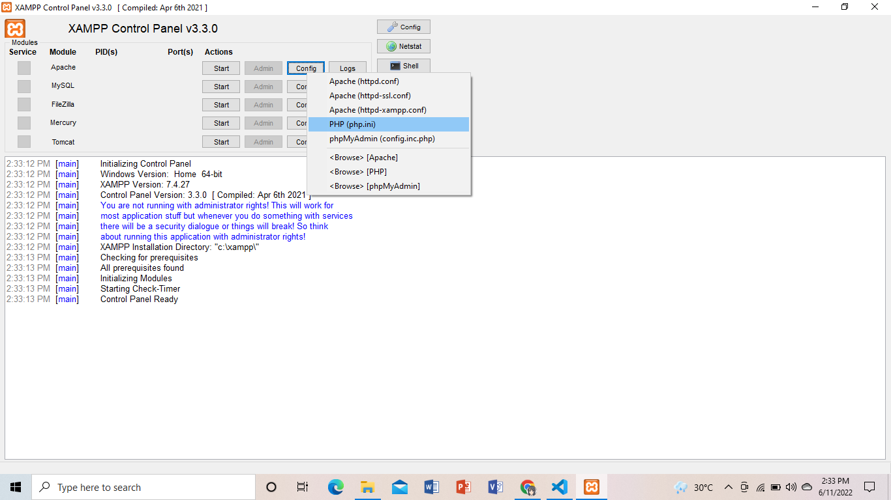

Pada bagian extention, hilangkan tanda ; (titik koma) pada ekstensi yang akan diaktifkan. Kemudian simpan kembali filenya dan restart Apache web server.


## 2. Instalasi Codeigniter 4
Untuk melakukan instalasi Codeigniter 4 dapat dilakukan dengan dua cara, yaitu cara manual dan menggunakan ***composer***. Pada praktikum ini kita menggunakan cara manual.

• Unduh **Codeigniter** dari website https://codeigniter.com/download

• Extrak file zip Codeigniter ke direktori **htdocs/lab11_ci**.

• Ubah nama direktory **framework-4.x.xx** menjadi **ci4**.

• Buka browser dengan alamat http://localhost/Lab11web/lab11_php_ci/ci4/public

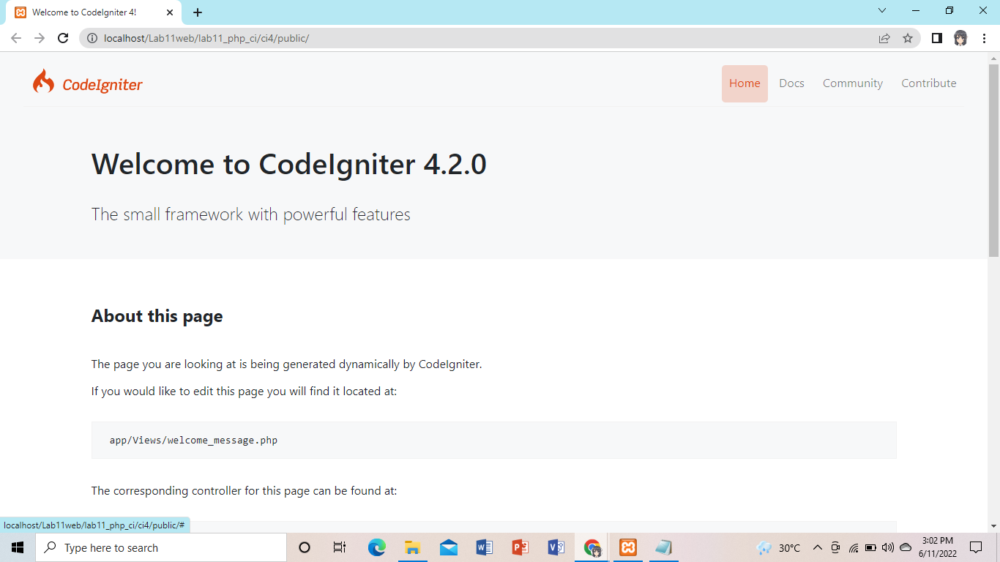

## 3. Menjalankan CLI (Command Line Interface)
Codeigniter 4 menyediakan CLI untuk mempermudah proses development. Untuk mengakses CLI buka terminal/command prompt.

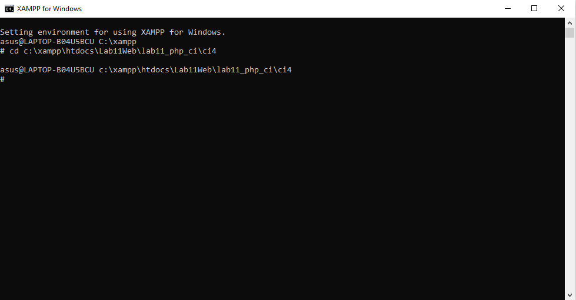

Arahkan lokasi direktori sesuai dengan direktori kerja project dibuat **(xampp/htdocs/lab11web/lab11_php_ci/ci4/)**

Perintah yang dapat dijalankan untuk memanggil CLI Codeigniter adalah:

```
php spark
```

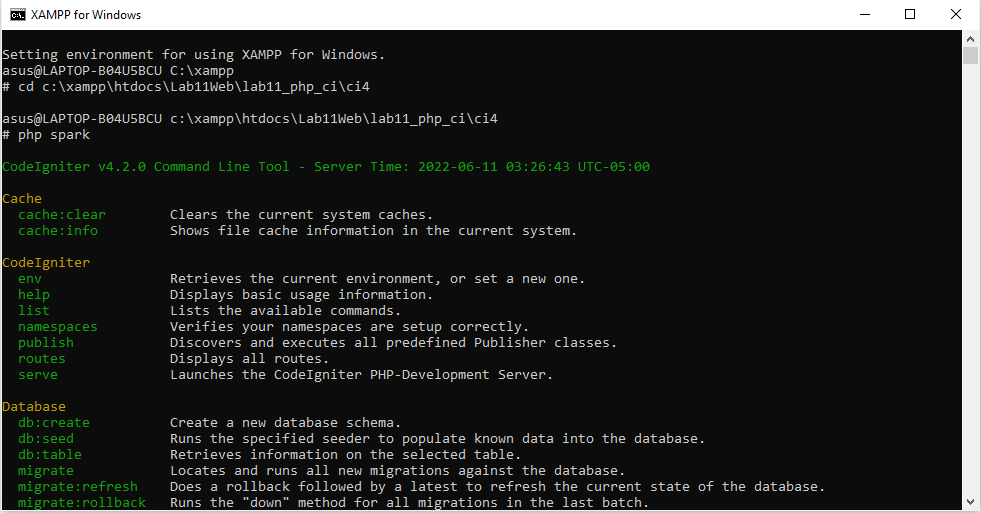

## 4. Mengaktifkan Mode Debugging
Codeigniter 4 menyediakan fitur **debugging** untuk memudahkan developer untuk mengetahui pesan error apabila terjadi kesalahan dalam membuat kode program.

Secara default fitur ini belum aktif. Ketika terjadi error pada aplikasi akan ditampilkan pesan kesalahan seperti berikut.

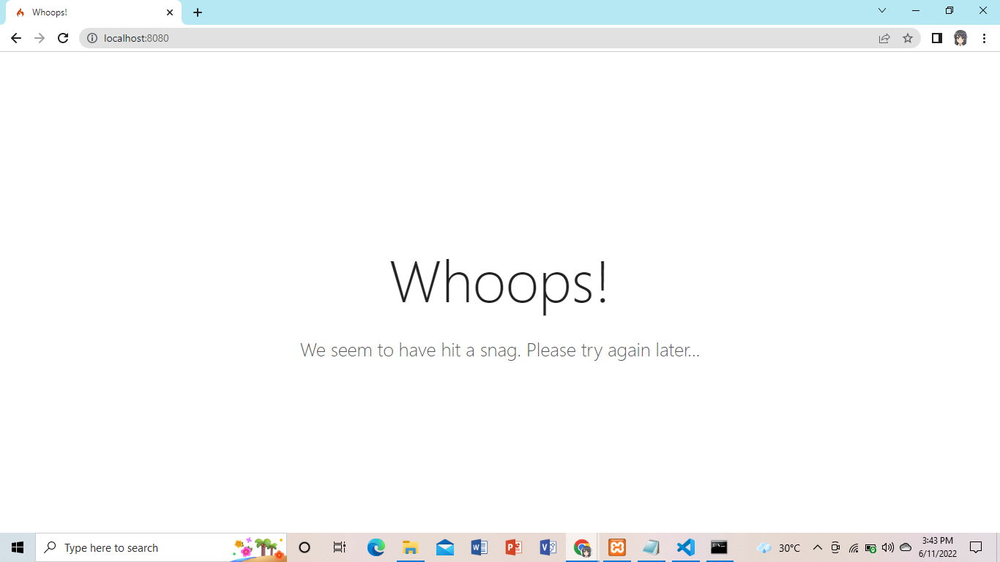

Semua jenis error akan ditampilkan sama. Untuk memudahkan mengetahui jenis errornya, maka perlu diaktifkan mode debugging dengan mengubah nilai konfigurasi pada environment variable **CI_ENVIRINMENT** menjadi **development**.

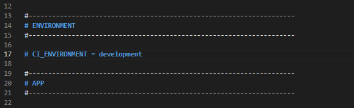

Ubah nama file **env** menjadi **.env** kemudian buka file tersebut dan ubah nilai variable **CI_ENVIRINMENT** menjadi **development**.


## 5. Membuat Route Baru

Tambahkan kode berikut di dalam **Routes.php**

```php
$routes->get('/about', 'Page::about');
$routes->get('/contact', 'Page::contact');
$routes->get('/faqs', 'Page::faqs');
```

Untuk mengetahui route yang ditambahkan sudah benar, buka CLI dan jalankan perintah berikut.

```
php spark routes
```

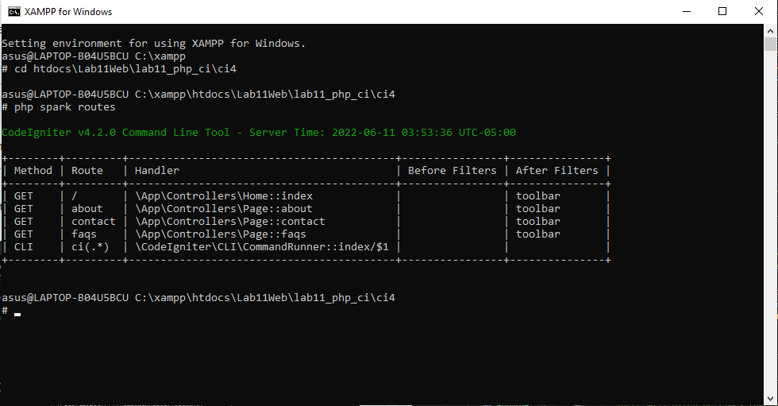

Selanjutnya coba akses route yang telah dibuat dengan mengakses alamat url 
http://localhost:8080/about

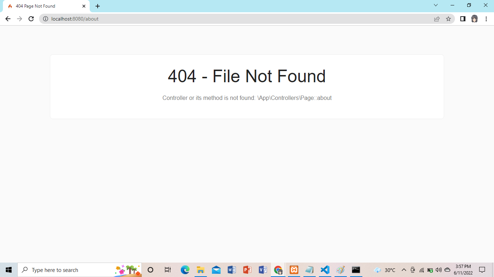

Ketika diakses akan mucul tampilan error 404 file not found, itu artinya file/page tersebut tidak ada. Untuk dapat mengakses halaman tersebut, harus dibuat terlebih dahulu Contoller yang sesuai dengan routing yang dibuat yaitu Contoller Page.

## 6. Membuat Controller

Selanjutnya adalah membuat Controller Page. Buat file baru dengan nama page.php pada direktori Controller kemudian isi kodenya seperti berikut.

```php
<?php

namespace App\Controllers;

class Page extends BaseController
{
    public function about()
    {
        echo "Ini halaman About";
    }

    public function contact()
    {
        echo "Ini halaman Contact";
    }

    public function faqs()
    {
        echo "Ini halaman FAQ";
    }
}

```

Selanjutnya refresh Kembali browser, maka akan ditampilkan hasilnya yaotu halaman sudah dapat diakses.

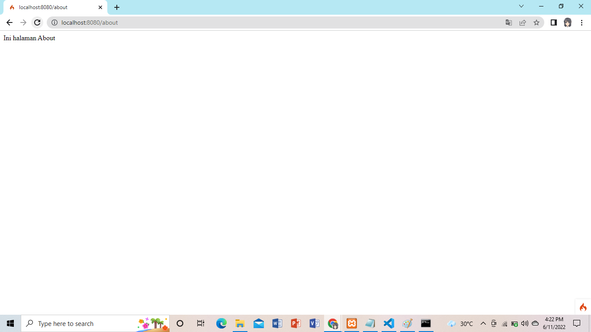

## 7. Auto Routing

Secara default fitur *autoroute* pada Codeiginiter sudah aktif. Untuk mengubah status autoroute dapat mengubah nilai variabelnya. Untuk menonaktifkan ubah nilai **true** menjadi **false**.

```php
$routes->setAutoRoute(true);
```

Tambahkan method baru pada **Controller Page** seperti berikut.

```php
public function tos()
{
    echo "ini halaman Term of Services";
}
```

Method ini belum ada pada **routing**, sehingga cara mengaksesnya dengan menggunakan alamat: http://localhost:8080/page/tos


## 8. Membuat View
Selanjutnya adalam membuat view untuk tampilan web agar lebih menarik. Buat file baru dengan nama about.php pada direktori view (**app/view/about.php**) kemudian isi kodenya seperti berikut.

```php
<!DOCTYPE html>
<html lang="en">
<head>
    <meta charset="UTF-8">
    <title><?= $title; ?></title>
</head>
<body>
    <h1><?= $title; ?></h1>
    <hr>
    <p><?= $content; ?></p>
</body>
</html>
```

Ubah **method about** pada class **Controller Page** menjadi seperti berikut:

```php
public function about()
{
    return view('about', [
        'title' => 'Halaman About',
        'content' => 'Ini adalah halaman abaut yang menjelaskan tentang isi halaman ini.'
    ]);
}
```

Kemudian lakukan refresh pada halaman tersebut.

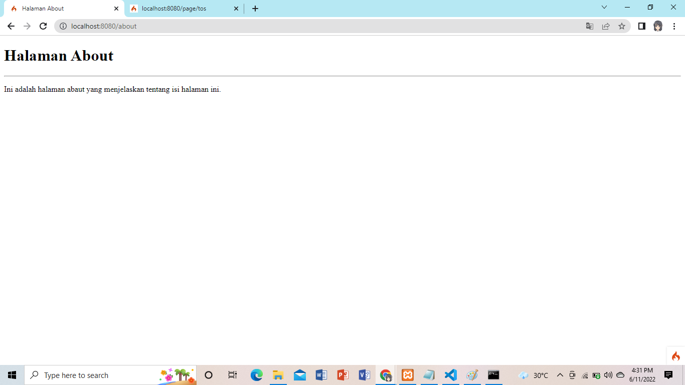

## 9. Membuat Layout Web dengan CSS
Pada dasarnya layout web dengan css dapat diimplamentasikan dengan mudah pada codeigniter. Yang perlu diketahui adalah, pada Codeigniter 4 file yang menyimpan asset css dan javascript terletak pada direktori **public**. 

Buat file css pada direktori **public** dengan nama **style.css** (copy file dari praktikum **lab4_layout**. Kita akan gunakan layout yang pernah dibuat pada praktikum 4.


Kemudian buat folder **template** pada direktori **view** kemudian buat file **header.php** dan **footer.php**

File **app/view/template/header.php**

```html
<!DOCTYPE html>
<html lang="en">
<head>
    <meta charset="UTF-8">
    <title><?= $title; ?></title>
    <link rel="stylesheet" href="<?= base_url('/style.css');?>">
</head>
<body>
    <div id="container">
    <header>
        <h1>Layout Sederhana</h1>
    </header>
    <nav>
        <a href="<?= base_url('/');?>" class="active">Home</a>
        <a href="<?= base_url('/artikel');?>">Artikel</a>
        <a href="<?= base_url('/about');?>">About</a>
        <a href="<?= base_url('/contact');?>">Kontak</a>
    </nav>
    <section id="wrapper">
        <section id="main">
```

File **app/view/template/footer.php**

```html
        </section>
        <aside id="sidebar">
            <div class="widget-box">
                <h3 class="title">Widget Header</h3>
                <ul>
                    <li><a href="#">Widget Link</a></li>
                    <li><a href="#">Widget Link</a></li>
                </ul>
            </div>
            <div class="widget-box">
                <h3 class="title">Widget Text</h3>
                <p>Vestibulum lorem elit, iaculis in nisl volutpat, malesuada tincidunt arcu. Proin in leo fringilla, vestibulum mi porta, faucibus felis. Integer pharetra est nunc, nec pretium nunc pretium ac.</p>
            </div>
        </aside>
    </section>
    <footer>
        <p>&copy; 2022 | Alingga Reandito</p>
    </footer>
    </div>
</body>
</html>    
```

Kemudian ubah file **app/view/about.php** seperti berikut.

```php
<?= $this->include('template/header'); ?>

<h1><?= $title; ?></h1>
<hr>
<p><?= $content; ?></p>

<?= $this->include('template/footer'); ?>
```

Selanjutnya refresh tampilan pada alamat http://localhost:8080/about

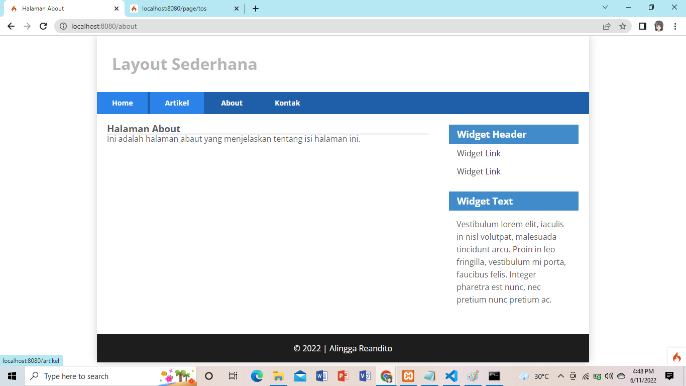

# Pertanyaan dan Tugas
Lengkapi kode program untuk menu lainnya yang ada pada Controller Page, sehingga semua link pada navigasi header dapat menampilkan tampilan dengan layout yang sama.

# Hasil

Pada halaman about saya ubah dari sebelumnya.
Untuk halaman **About**

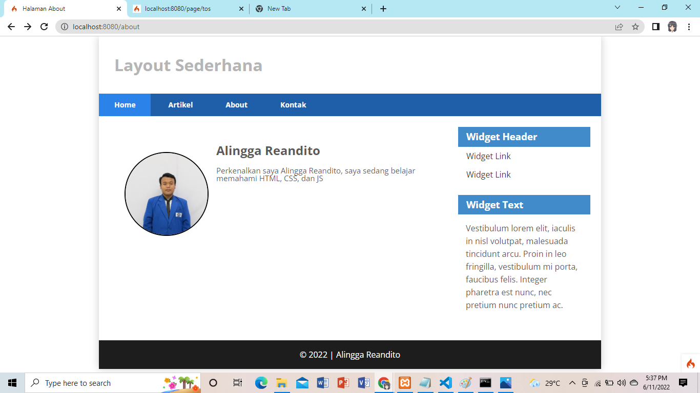

Untuk halaman **Kontak**

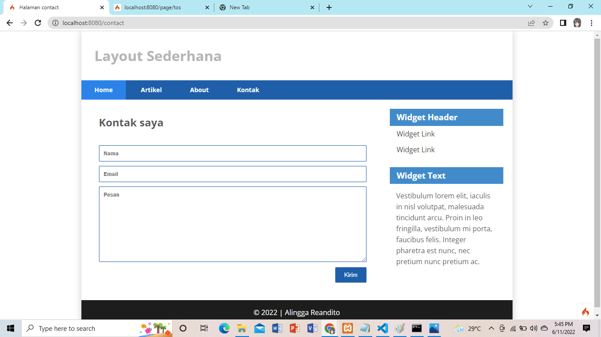

## Tugas Lab 11 Web (Pratikum 12 CRUD)
# Langkah 1 `Membuat DB`

1. Buat database baru dengan nama `lab_ci4` dengan query berikut.

```
CREATE DATABASE lab_ci4;
```

2. Membuat Table baru dengan nama `artikel` dengan query berikut.

```
CREATE TABLE artikel {
    id INT(11) auto_increment,
    judul VARCHAR(200) NOT NULL,
    isi TEXT,
    gambar VARCHAR(200),
    status TINYINT(1) DEFAULT 0,
    slug VARCHAR(200),
    PRIMARY KEY(id)
}
```

## Langkah 2 Konfigurasi koneksi database

1. Buka file `.env`, lalu edit seperti berikut.
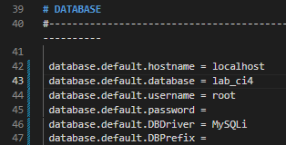

## Langkah 3 `Membuat Model`

1. Buat file baru dengan nama `ArtikelModel.php` pada direktori `app/Models`.
2. Tambahkan kode berikut.

```
<?php
namespace App\Models;
use CodeIgniter\Model;

class ArtikelModel extends Model {
    protected $table = 'artikel';
    protected $primary = 'id';
    protected $setAutoIncrement = TRUE;
    protected $allowedFields = ['judul', 'isi', 'status', 'slug', 'gambar', 'date_created'];
}
```

## Langkah 4 Membuat Controller

1. Buat file baru dengan nnama `Artikel.php` pada direktori `app/Controller`.
2. Tambahkan kode berikut.

```
<?php

namespace App\Controllers;

use App\Models\ArtikelModel;
use CodeIgniter\Controller;
use CodeIgniter\Exceptions\PageNotFoundException;
use CodeIgniter\I18n\Time;

class Artikel extends Controller
{
    protected $artikel;

    public function __construct()
    {
        $this->artikel = new ArtikelModel();
    }

    public function index()
    {
        $title = 'Daftar Artikel';
        $artikels = $this->artikel->findAll();

        return view('artikel/home', compact('title', 'artikels'));
    }
}
```

## Langkah 5 `Membuat View`

1. Buat file baru dengan nama `home.php` pada direktori `app/Views/artikel`.
2. Tambahkan kode berikut.

```
<?= $this->include('template/_header.php'); ?>

<h1 class="display-4">Artikel</h1>

<?php if ($artikels) : foreach ($artikels as $artikel) : ?>
        <div class="card">
            <div class="card-header">
                <h2><a href="<?= base_url('artikel/') . $artikel['slug'] ?>"><?= $artikel['judul'] ?></a></h2>
            </div>

            <div class="card-body">
                <p><?= substr($artikel['isi'], 0, 200) ?></p>
            </div>
        </div>
    <?php endforeach;
else : ?>
<div class="card">
    <div class="card-body">Belum ada data</div>
</div>
<?php endif; ?>

<?= $this->include('template/_footer.php'); ?>
```
3. Maka hasilnya akan seperti berikut.
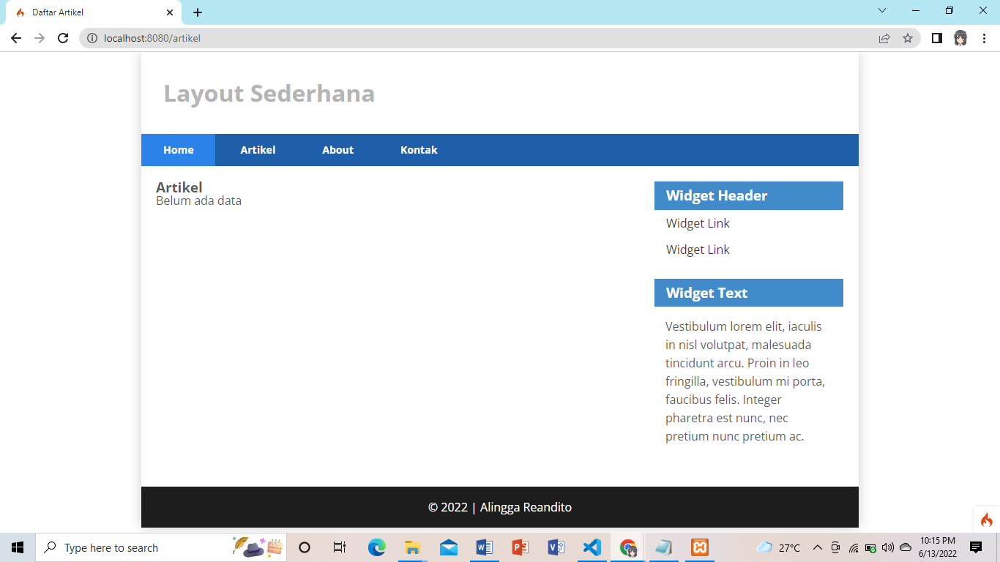

4. Karena datanya belum ada, kita tambah data dengan menjalankan query berikut diphpmyadmin.

```
INSERT INTO artikel (judul, isi, slug) VALUE
('Artikel pertama', 'Lorem Ipsum adalah contoh teks atau dummy dalam industri
percetakan dan penataan huruf atau typesetting. Lorem Ipsum telah menjadi
standar contoh teks sejak tahun 1500an, saat seorang tukang cetak yang tidak
dikenal mengambil sebuah kumpulan teks dan mengacaknya untuk menjadi sebuah
buku contoh huruf.', 'artikel-pertama'),
('Artikel kedua', 'Tidak seperti anggapan banyak orang, Lorem Ipsum bukanlah
teks-teks yang diacak. Ia berakar dari sebuah naskah sastra latin klasik dari
era 45 sebelum masehi, hingga bisa dipastikan usianya telah mencapai lebih
dari 2000 tahun.', 'artikel-kedua');
```

5. Maka hasilnya seperti berikut.
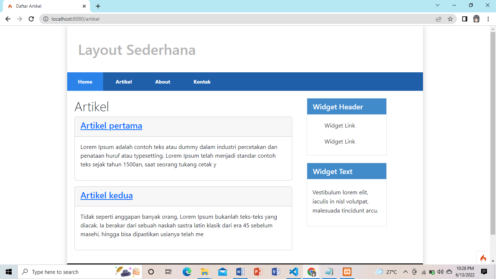

## Langkah 6 `Detail View`

1. Tambahkan method baru dengan nama `detail_artikel($slug)` pada Controller `Artikel.php`
2. Maka kodenya seperti berikut.

```
public function detail_artikel($slug)
{
    $artikel = $this->artikel->where([
        'slug' => $slug
    ])->first();

    if (!$artikel) {
        throw PageNotFoundException::forPageNotFound();
    }
    $title = $artikel['judul'];

    return view('artikel/detail_artikel', compact('title', 'artikel'));
}
```

3. Tambahkan Routes baru dengan kode seperti berikut.

```
$routes->get('/artikel/(:any)', 'Artikel::detail_artikel/$1');
```

4. Buat file baru dengan nama `detail_artikel.php` didalam direktori `app/Views/artikel`.
5. Tambahkan kode berikut.

```
<?= $this->include('template/_header.php'); ?>

<h1 class="display-4" style="font-size: 36px;">Detail <?= $artikel['judul'] ?></h1>

<div class="card my-3">
    <div class="card-header">
        <h4><?= $artikel['judul'] ?></h4>
    </div>

    <div class="card-body">
        <!-- " alt="<?= $artikel['judul'] ?>"> -->
        <p><?= $artikel['isi'] ?></p>
    </div>

    <div class="card-footer text-center">
        <?= $artikel['date_created'] ?>
    </div>
</div>

<?= $this->include('template/_footer.php'); ?>
```

6. Maka hasilnya sebagai berikut.
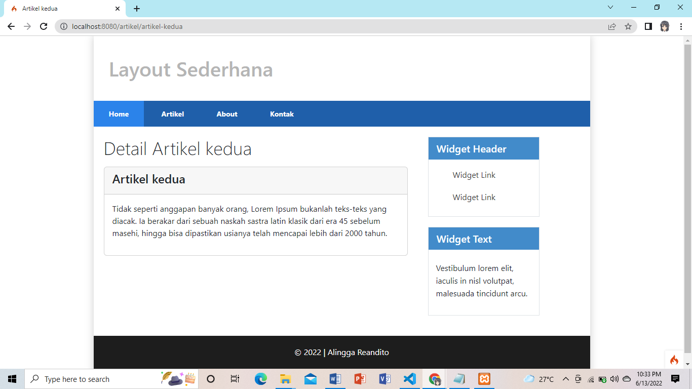

## Langkah `Membuat Menu Admin`

1. Buat method baru dengan nama `admin()` didalam Controller `Artikel`.
2. Tambahkan kode berikut.

```
public function admin()
{
    $title = 'Daftar Artikel';
    $artikel = $this->artikel->findAll();

    return view('artikel/admin', compact('title', 'artikel'));
}
```

3. Tambahkan route baru seperti berikut.

```
$routes->group('artikel/admin', function($routes) {
    $routes->get('/', 'Artikel::admin');

    // Add
    $routes->get('add', 'Artikel::add_artikel');
    $routes->add('store', 'Artikel::store');

    // Edit
    $routes->get('edit/(:any)', 'Artikel::edit/$1');
    $routes->add('update/(:any)', 'Artikel::update/$1');

    // Delete
    $routes->get('delete/(:any)', 'Artikel::delete/$1');
});
```

4. Buat 2 file template dengan nama `admin_header.php` dan `admin_footer.php` didalam direktor `app/Views/template`

```
// admin_header.php
<?php

use CodeIgniter\Config\Services;

$request = Services::request();
?>

<!doctype html>
<html lang="en">

<head>
    <!-- Required meta tags -->
    <meta charset="utf-8">
    <meta name="viewport" content="width=device-width, initial-scale=1">

    <!-- Bootstrap CSS -->
    <link rel="stylesheet" href="<?= base_url('css/bootstrap.min.css') ?>">

    <!-- My CSS -->
    <!-- <link rel="stylesheet" href="<?= base_url('css/style_admin.css') ?>"> -->

    <title>Admin | <?= $title ?></title>
</head>

<body>
    <nav class="navbar navbar-expand-lg navbar-dark p-0" style="background-color: purple;">
        <div class="container p-0">
            <a class="navbar-brand" href="<?= base_url('artikel/admin') ?>">Admin</a>
            <button class="navbar-toggler ms-auto m-1" type="button" data-bs-toggle="collapse" data-bs-target="#navbarNav" aria-controls="navbarNav" aria-expanded="false" aria-label="Toggle navigation">
                <span class="navbar-toggler-icon"></span>
            </button>
            <div class="collapse navbar-collapse" id="navbarNav">
                <ul class="navbar-nav">
                    <li class="nav-item">
                        <a class="nav-link <?= $request->uri->getSegment(3) == '' ? 'active' : '' ?>" href="<?= base_url('artikel/admin') ?>">Dashboard</a>
                    </li>
                    <li class="nav-item">
                        <a class="nav-link <?= $request->uri->getSegment(3) == 'artikel' ? 'active' : '' ?>" href="<?= base_url('artikel') ?>">Artikel</a>
                    </li>
                </ul>
            </div>
        </div>
    </nav>

    <?php
    if (session()->getFlashdata('errors')) {
    ?>
        <div class="alert alert-danger alert-dismissible fade show pb-0" role="alert">
            <div class="container">
                <?= session()->getFlashdata('errors') ?>
                <button type="button" class="btn-close" data-bs-dismiss="alert" aria-label="Close"></button>
            </div>
        </div>
    <?php
    } else if (session()->getFlashdata('success')) {
    ?>
        <div class="alert alert-primary alert-dismissible fade show" role="alert">
            <div class="container">
                <?= session()->getFlashdata('success') ?>
                <button type="button" class="btn-close" data-bs-dismiss="alert" aria-label="Close"></button>
            </div>
        </div>
    <?php } ?>
```

```
// admin_footer.php
<footer class="bg-dark text-white p-3 text-center">
    <p class="m-0">&copy; 2022 - Universitas Pelita Bangsa @ Reza Riyaldi</p>
</footer>


<script src="<?= base_url('js/bootstrap.min.js') ?>"></script>
</body>

</html>
```

5. Buat file baru dengan nama `admin.php` didalam direktori `app/Views/artikel`, dan tambahkan kode berikut.

```
<?= $this->include('template/admin_header.php'); ?>

<div class="container py-5">
    <h1 class="display-4 d-inline" style="font-size: 36px; border-bottom: 5px solid #ddd;"><?= $title ?></h1>

    <a href="<?= base_url('artikel/admin/add') ?>" class="btn btn-primary btn-sm d-block mt-4">+ Tambah Artikel</a>
    <table class="table table-hover table-bordered">
        <thead>
            <tr class="text-center">
                <th>No</th>
                <th>Judul</th>
                <th>Status</th>
                <th>Option</th>
            </tr>
        </thead>

        <tbody>
            <?php
            $no = 1;
            if ($artikels) {
                foreach ($artikels as $artikel) { ?>
                    <tr>
                        <td class="text-center" style="vertical-align: middle;"><?= $no++ ?></td>
                        <td>
                            <b class="d-block"><?= $artikel['judul'] ?></b>
                            <small><?= substr($artikel['isi'], 0, 50) ?></small>
                        </td>
                        <td class="text-center" style="vertical-align: middle;"><?= $artikel['status'] ?></td>
                        <td class="text-center" style="vertical-align: middle;">
                            <a href="<?= base_url() . '/artikel/admin/edit/' . $artikel['slug'] ?>" class="btn btn-warning btn-sm">Edit</a>
                            <a href="<?= base_url() . '/artikel/admin/delete/' . $artikel['slug'] ?>" class="btn btn-danger btn-sm" onclick="return confirm('Apakah anda yakin ingin menghapus <?= $artikel['judul'] ?>?')">Delete</a>
                        </td>
                    </tr>
                <?php }
            } else { ?>
                <tr>
                    <td colspan="4" class="text-center">Data masih kosong</td>
                </tr>
            <?php } ?>
        </tbody>

        <!-- <tfoot>
            <tr>
                <th>No</th>
                <th>Judul</th>
                <th>Status</th>
                <th>Option</th>
            </tr>
        </tfoot> -->
    </table>
</div>

<?= $this->include('template/admin_footer.php'); ?>
```

6. Maka hasilnya seperti berikut.
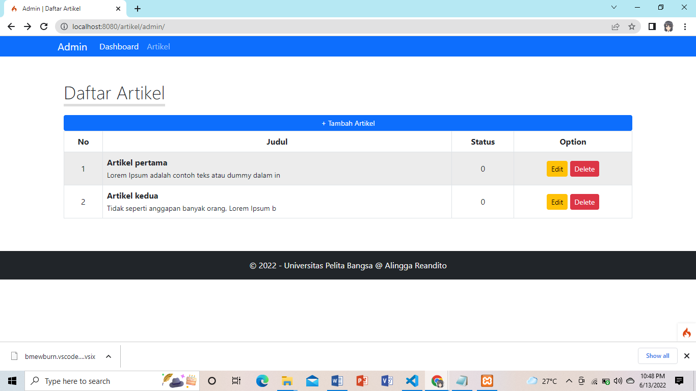

## Langkah 8 `Add Artikel`

1. Buat 2 Method baru dengan nama `add_artikel()`, `store()` didalam Controller `Artikel`.
2. Tambahkan kode berikut.

```
public function add_artikel()
{

    $title = 'Tambah Artikel';
    return view('artikel/tambah_artikel', compact('title'));
}

public function store()
{
    if (!$this->validate([
        'judul' => [
            'rules' => 'required',
            'errors' => [
                'required' => 'Judulnya diisi dong sayang'
            ],
        ],
        'isi' => [
            'rules' => 'min_length[10]',
            'errors' => [
                'min_length' => 'Minimal 10 karakter aja kok, yok bisa yok'
            ]
        ]
    ])) {
        session()->setFlashdata('errors', $this->validator->listErrors());
        redirect()->back()->withInput();
    }

    // var_dump($this->request->getPost()); die();

    $this->artikel->insert([
        'judul' => ucwords(strtolower($this->request->getPost('judul'))),
        'isi' => $this->request->getPost('isi'),
        'slug' => url_title(strtolower($this->request->getPost('judul'))),
    ]);

    session()->setFlashdata('success', 'Berhasil menambah data');
    return redirect()->to('artikel/admin');
}
```

3. Buat file baru dengan nama `tambah_artikel.php` didalam direktori `app/Views/artikel`, lalu tambahkan kode berikut.

```
<?= $this->include('template/admin_header'); ?>

<div class="container py-5">
    <h1 class="display-4 d-inline" style="font-size: 36px; border-bottom: 5px solid #ddd;">Tambah Artikel</h1>

    <div class="row m-0 mt-4">
        <div class="col-md-6 p-0">
            <div class="card">
                <div class="card-body">
                    <form action="<?= base_url('artikel/admin/store') ?>" method="post">
                        <div class="mb-3">
                            <label for="" class="form-label">Judul</label>
                            <input type="text" class="form-control" name="judul" placeholder="Masukan judul yang menarik" value="<?= old('judul') ?>">
                        </div>

                        <div class="mb-3">
                            <label for="" class="form-label">Isi</label>
                            <textarea name="isi" id="" cols="" rows="" placeholder="Buatlah artikel yang menarik" class="form-control"><?= old('isi') ?></textarea>
                        </div>

                        <button type="submit" class="btn btn-primary">Tambah Artikel</button>
                    </form>
                </div>
            </div>
        </div>
    </div>
</div>

<?= $this->include('template/admin_footer'); ?>
```

4. Maka hasilnya sebagai berikut.
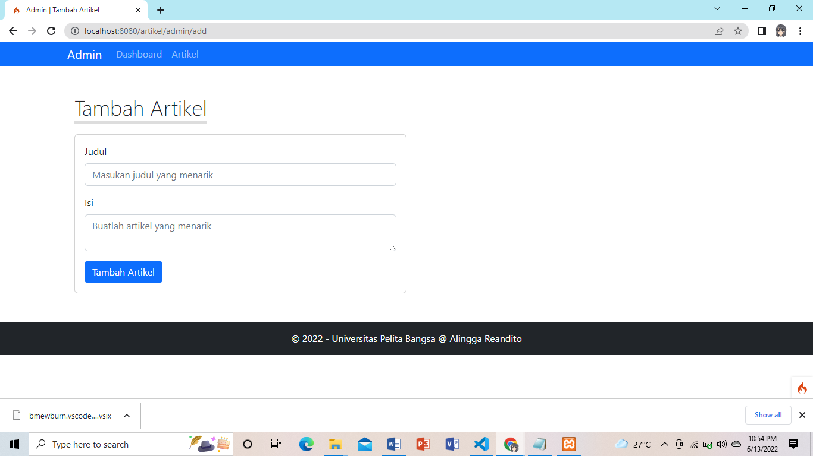

5. Apabila ada kesalahan.
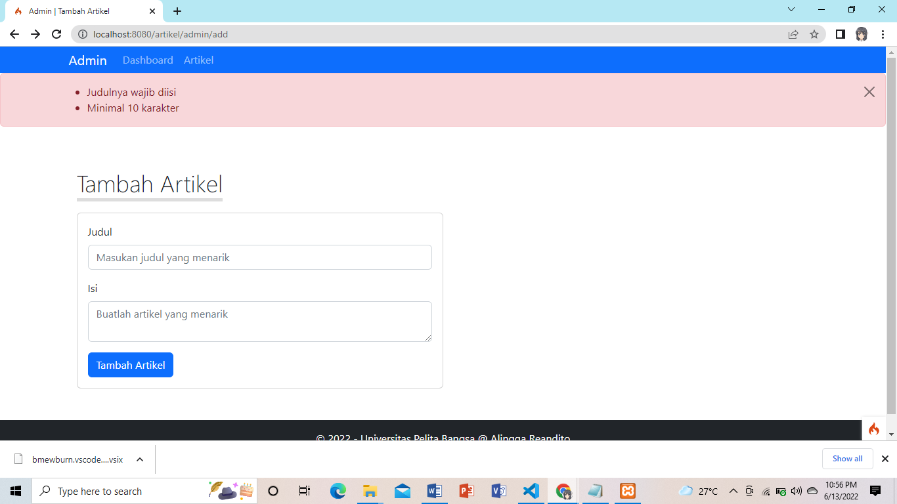

6. Apabila berhasil


## Langkah 9 `Update Artikel`

1. Buat 2 method baru dengan nama `edit(slug)` dan `update($id)` didalam Controller `Artikel`, Tambahkan kode berikut.

```
public function edit($slug)
{
    $data =[
        'title' => 'Edit Artikel',
        'artikel' => $this->artikel->where('slug', $slug)->first()
    ];

    return view('artikel/edit_artikel', $data);
}

public function update($id)
{
    if (!$this->validate([
        'judul' => [
            'rules' => 'required',
            'errors' => [
                'required' => 'Judulnya diisi dong sayang'
            ],
        ],
        'isi' => [
            'rules' => 'min_length[10]',
            'errors' => [
                'min_length' => 'Isi konten 10 karakter aja kok, yok bisa yok'
            ]
        ]
    ])) {
        session()->setFlashdata('errors', $this->validator->listErrors());
        return redirect()->back();
    }

    $this->artikel->update($id, [
        'judul' => ucwords(strtolower($this->request->getPost('judul'))),
        'isi' => $this->request->getPost('isi'),
        'slug' => url_title(strtolower($this->request->getPost('judul')))
    ]);

    session()->setFlashdata('success', 'Berhasil mengubah data');
    return redirect()->to('artikel/admin');
}
```

2. Tambahkan file baru dengan nama `edit_artikel.php` didalam direktori `app/Views/artikel`, lalu tambahkan kode berikut.

```
<?= $this->include('template/admin_header'); ?>

<div class="container py-5">
    <h1 class="display-4 d-inline" style="font-size: 36px; border-bottom: 5px solid #ddd;">Edit Artikel</h1>

    <div class="row m-0 mt-4">
        <div class="col-md-6 p-0">
            <div class="card">
                <div class="card-body">
                    <form action="<?= base_url(). '/artikel/admin/update/' . $artikel['id'] ?> " method="post">
                        <div class="mb-3">
                            <label for="" class="form-label">Judul</label>
                            <input type="text" class="form-control" name="judul" placeholder="Masukan judul yang menarik" value="<?= $artikel['judul'] ?>">
                        </div>

                        <div class="mb-3">
                            <label for="" class="form-label">Isi</label>
                            <textarea name="isi" id="" cols="" rows="" placeholder="Buatlah artikel yang menarik" class="form-control"><?= $artikel['isi'] ?></textarea>
                        </div>

                        <button type="submit" class="btn btn-primary">Edit Artikel</button>
                    </form>
                </div>
            </div>
        </div>
    </div>
</div>

<?= $this->include('template/admin_footer'); ?>
```

3. Maka hasilnya akan seperti berikut.
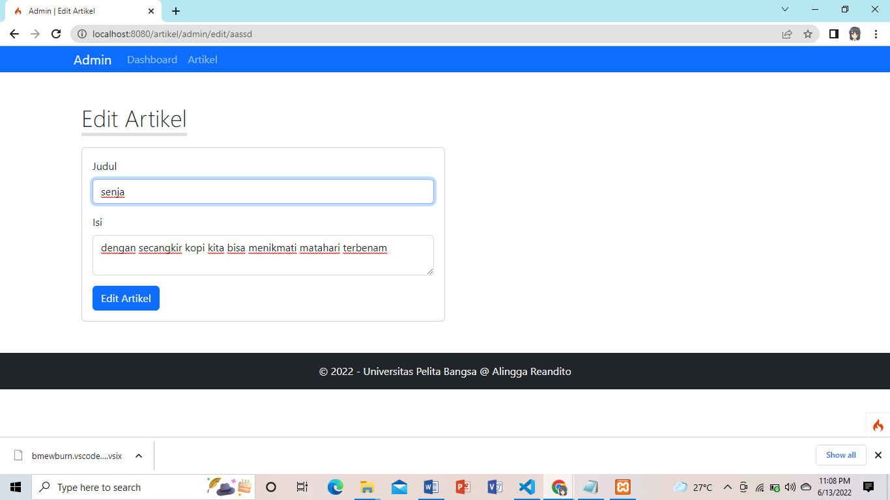

4. Apabila berhasil maka hasilnya seperti berikut.
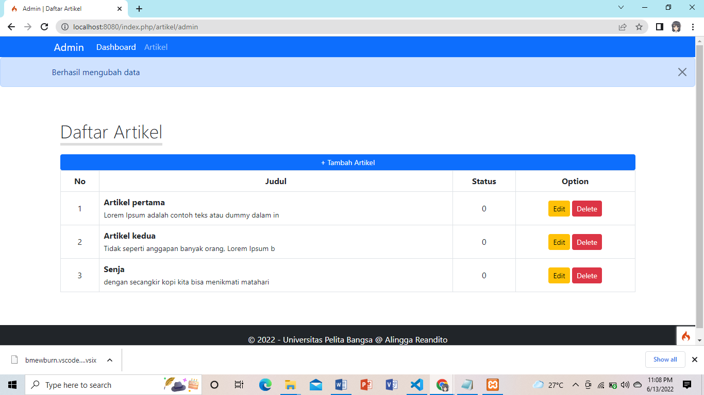

## Langkah 10 `Delete Artikel`

1. Tambahkan method baru dengan nama `delete($slug)` didalam Controller `Artikel`, lalu tambahkan kode berikut.

```
public function delete($slug)
{
    if($this->artikel->where('slug', $slug)->first() === NULL) {
        throw PageNotFoundException::forPageNotFound('Data tidak ditemukan!');
    }

    $this->artikel->where('slug', $slug)->delete();

    session()->setFlashdata('success', 'Berhasil hapus data');
    return redirect('artikel/admin');
}
```

2. Maka ketika tombol delete diklik, akan seperti berikut.
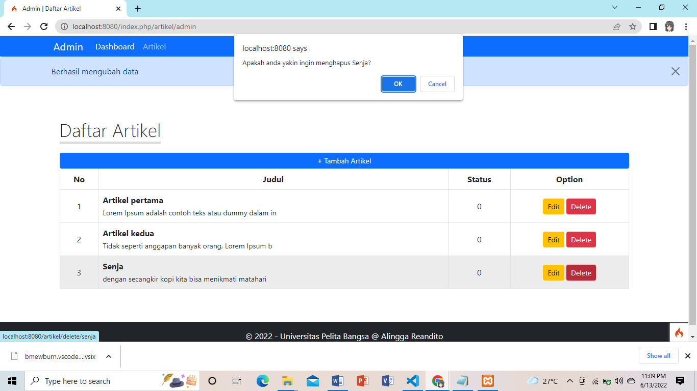

3. Apabila yes akan seperti berikut.
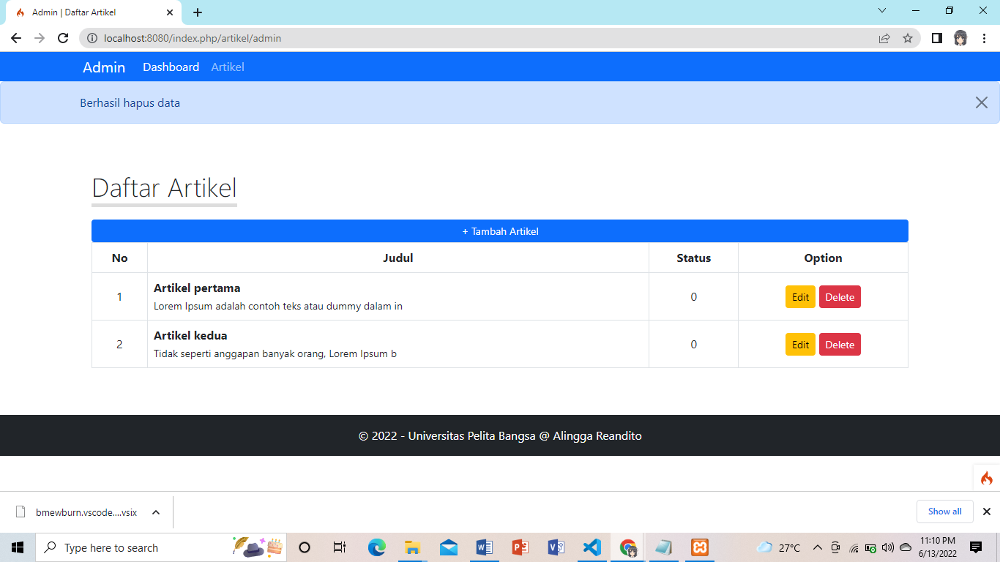